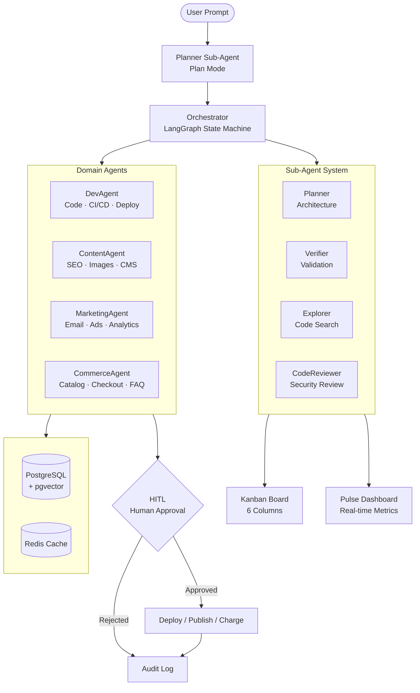

<p align="center">
  
  
  
  
  
  
  
  
</p>

<h1 align="center">🤖 AgentOS</h1>
<p align="center"><b>AI Agent Orchestration System</b> · The open-source alternative to Verdent.ai · Transformez une intention en workflow IA exécutable</p>

<p align="center">
  <a href="#-quick-install">🚀 Quick Install</a> •
  <a href="#-architecture">🏗️ Architecture</a> •
  <a href="#-agents--sub-agents">🎯 Agents</a> •
  <a href="#-comparison-verdentai-vs-agentos">⚡ Comparison</a> •
  <a href="#-features">✨ Features</a> •
  <a href="#-quick-start">📖 Quick Start</a> •
  <a href="#-api">📡 API</a>
</p>

<br>

---

## 🚀 Quick Install

```bash
curl -sSL https://raw.githubusercontent.com/HiTechTN/agentos/main/install.sh | bash
```

<details>
<summary><b>⚙️ What this does</b> — click to expand</summary>

| Step | Action |
|------|--------|
| 1 | Checks prerequisites (git, docker, docker compose) |
| 2 | Clones the repo (`--depth 1`) |
| 3 | Copies `.env.example` → `.env` |
| 4 | Pulls Docker images |
| 5 | Runs `docker compose up -d` |

> **Prerequisites**: git · docker · docker compose
</details>

---

## 🏗️ Architecture



### 🔄 Pipeline Flow (Plan → Code → Verify)

```
User Prompt
  ↓
@Planner → Structured Plan (phases, tasks, dependencies, risks)
  ↓
Main Agent dispatches to domain agents + sub-agents
  ↓
@Verifier validates output → @CodeReviewer audits → Kanban updates
  ↓
Git worktree isolation → parallel execution without conflicts
  ↓
Pulse dashboards + Slack/Console notifications
  ↓
HITL gate → Deploy / Publish / Charge
```

<details>
<summary><b>📦 Services</b></summary>

| Container | Role | Port |
|-----------|------|------|
| `postgres` | PostgreSQL 17 + pgvector | 5432 |
| `redis` | Redis 7 + AOF persistence | 6379 |
| `ollama` | Local LLM fallback (qwen2.5) | 11434 |
| `mailhog` | SMTP email preview | 1025 · 8025 |
| `strapi` | Headless CMS | 1337 |
| `jaeger` | Distributed tracing (OTLP) | 16686 · 4318 |
| `minio` | S3-compatible object storage | 9000 · 9001 |
| `caddy` | TLS reverse proxy | 80 · 443 |
| `app` | FastAPI orchestrator | 8000 |
| `web` | Next.js dashboard | 3000 |

</details>

---

## 🎯 Agents & Sub-Agents

### Domain Agents

<table>
<tr>
  <td width="25%" align="center">
    <h3>💻 DevAgent</h3>
    <span style="background:#e7f5ff;color:#1971c2;padding:2px 8px;border-radius:4px;font-size:12px">code</span>
    <p>Scaffold repos · CI/CD · Tests · Deploy</p>
    <small>🔧 GitHub API · Docker · pytest</small>
  </td>
  <td width="25%" align="center">
    <h3>📝 ContentAgent</h3>
    <span style="background:#f3f0ff;color:#7048e8;padding:2px 8px;border-radius:4px;font-size:12px">content</span>
    <p>SEO copy · Images · CMS · Calendar</p>
    <small>✍️ GPT-4o · Replicate · Strapi</small>
  </td>
  <td width="25%" align="center">
    <h3>📊 MarketingAgent</h3>
    <span style="background:#fff0f6;color:#c2255c;padding:2px 8px;border-radius:4px;font-size:12px">growth</span>
    <p>Segments · Campaigns · Ads · Reports</p>
    <small>📧 SMTP · Meta/Google · GA4</small>
  </td>
  <td width="25%" align="center">
    <h3>💰 CommerceAgent</h3>
    <span style="background:#ebfbee;color:#2b8a3e;padding:2px 8px;border-radius:4px;font-size:12px">sales</span>
    <p>Catalog · Pricing · Stripe · FAQ</p>
    <small>💳 Stripe · Redis · LangChain</small>
  </td>
</tr>
</table>

### Sub-Agent System (like Verdent, but better)

| Sub-Agent | Role | Auto-Route Trigger |
|-----------|------|-------------------|
| **@Planner** | Architecture design, structured plan with phases/tasks/risks | `plan`, `design`, `architecture`, `how to` |
| **@Verifier** | Code validation, lint, type safety, coverage | `verify`, `validate`, `test`, `check quality` |
| **@Explorer** | Codebase navigation, dependency tracing | `explore`, `find`, `search`, `where is` |
| **@CodeReviewer** | Security audit, performance, architecture review | `review`, `audit`, `security check` |

Sub-agents auto-route based on task intent, or invoke explicitly via `POST /api/v1/sub-agent/run`.

Custom sub-agents: create markdown files in `~/.agentos/subagents/<name>.md` with YAML frontmatter.

---

## ⚡ Comparison: Verdent.ai vs AgentOS

| Feature | Verdent.ai | AgentOS (v4.0) |
|---------|-----------|----------------|
| **Open-source** | ❌ Proprietary | ✅ MIT License |
| **Multi-domain** | ❌ Code only | ✅ Code + Content + Marketing + Commerce |
| **Sub-agents** | Built-in + custom | ✅ @Planner, @Verifier, @Explorer, @CodeReviewer + custom |
| **Plan Mode** | Plan-verify loop | ✅ Structured plan with phases, tasks, risks, dependencies |
| **Verify Mode** | Built-in | ✅ JSON-format validation |
| **AGENTS.md rules** | ✅ | ✅ Project + global + plan rules, auto-init |
| **Kanban board** | Column view | ✅ 6 columns, full CRUD API + WebSocket |
| **Pulse dashboards** | Real-time | ✅ Agent activity + metrics + timeline |
| **MCP integration** | ✅ | ✅ Register + call any MCP server |
| **Git worktree** | Per-task isolation | ✅ Full CRUD management API |
| **Human-in-the-Loop** | ❌ | ✅ Approve/reject deploy, publish, charge |
| **Observability** | ❌ | ✅ Prometheus + Jaeger + WebSocket logs |
| **LLM Cache** | ❌ | ✅ In-memory SHA256-keyed cache |
| **Multi-model routing** | ✅ BYOK | ✅ Claude/GPT-4o/Mixtral per task type |
| **RAG memory** | ❌ | ✅ pgvector 768d across sessions |
| **Parallel execution** | ✅ | ✅ asyncio.gather + worktree isolation |
| **Deployment** | Desktop + IDE | ✅ Docker Compose + API + Web dashboard |
| **Scheduler** | Natural language | ✅ Cron-based + API |
| **Notifications** | Slack/Telegram | ✅ Slack + Console + webhook |
| **Pricing** | Credits + subscription | ✅ Free, self-hosted |

---

## ✨ Features

| | Feature | Description |
|---|---------|-------------|
| 🧠 | **4 Domain Agents** | Dev, Content, Marketing, Commerce — each with domain-specific tools |
| 🧩 | **Sub-Agent System** | @Planner, @Verifier, @Explorer, @CodeReviewer with auto-routing + custom |
| 📋 | **Plan Mode** | Structured plans with phases, tasks, risks, dependencies, architecture |
| ✅ | **Verify Mode** | Automatic code validation with JSON issue tracking |
| 👤 | **Human-in-the-Loop** | Deploy, publish, charge actions require your approval |
| 📊 | **Kanban Board** | 6 columns (backlog → done), full CRUD, WebSocket updates |
| 📈 | **Pulse Dashboards** | Real-time metrics, agent activity, task tracking |
| 🔗 | **MCP Integration** | Register and call any MCP-compatible tool server |
| 📝 | **AGENTS.md Rules** | Project rules, global rules, plan rules with auto-init |
| 🔄 | **LLM Fallback** | OpenRouter → Ollama local → degraded response |
| 🧩 | **Vector Memory** | PostgreSQL + pgvector (768d) for project context |
| ⚡ | **Redis Cache** | Tiered TTL: LLM · sessions · projects |
| ⛔ | **Circuit Breaker** | Auto-disables agents after 3 consecutive failures |
| 📋 | **JSON Logging** | Immutable structured logs with secret masking |
| 🏖️ | **Docker Sandbox** | Isolated execution, filtered network, resource limits |
| 🎯 | **Configurable Priority** | Task priority system (0–10) |
| 📦 | **1-Click Deploy** | `docker compose up` — full stack in one command |
| ⚡ | **Parallel Execution** | Independent agents run concurrently via asyncio.gather |
| 🔄 | **Multi-Model Routing** | Claude for code, GPT-4o for content, Mixtral for analysis |
| 💾 | **LLM Response Cache** | In-memory SHA256-keyed cache reduces API costs |
| 📡 | **WebSocket Logs** | Real-time log streaming at `/ws/logs` |
| 📊 | **Prometheus Metrics** | `/metrics` endpoint for counters, histograms, gauges |
| 🔍 | **Distributed Tracing** | OpenTelemetry spans exported to Jaeger |
| 🔔 | **Notifications** | Slack + Console multi-channel broadcasts |
| 🗓️ | **Scheduler** | Cron-based periodic task execution |
| 🏢 | **Workspaces** | Multi-tenant project isolation |
| 🌲 | **Git Worktree** | Safe parallel execution in isolated branches |

<details>
<summary><b>🔒 Security & Compliance</b></summary>

- Secrets in `.env` only — never in code
- Partial secret masking in logs (tokens masked)
- Sandbox with filtered network access
- JWT/session-based auth for dashboard
- Audit trail via immutable JSON logs
- HITL gate on all destructive actions (deploy, publish, charge)
</details>

---

## 📖 Quick Start

### 1️⃣ Configure

```bash
cp .env.example .env
# Edit .env with your API keys (or use defaults for local-only mode)
```

### 2️⃣ Launch

```bash
docker compose up -d
```

<details>
<summary><b>⏳ Wait for health checks</b></summary>

```bash
watch docker compose ps  # Wait until all services are "healthy"
```
</details>

### 3️⃣ Verify

```bash
curl http://localhost:8000/health
# → {"status":"ok","version":"4.0.0","environment":"development"}
```

### 4️⃣ Run a workflow

```bash
curl -X POST http://localhost:8000/api/v1/run \
  -H "Content-Type: application/json" \
  -d '{"prompt": "Create a landing page for a SaaS product"}'
```

### 5️⃣ Create a plan (Plan Mode)

```bash
curl -X POST http://localhost:8000/api/v1/plan \
  -H "Content-Type: application/json" \
  -d '{"goal": "Build an e-commerce site with Stripe payments"}'
```

### 6️⃣ Check the Kanban board

```bash
curl http://localhost:8000/api/v1/kanban/default
```

### 7️⃣ View Pulse dashboard

```bash
curl http://localhost:8000/api/v1/pulse/default
```

---

## 🎮 Makefile Commands

<table>
<tr><th>Command</th><th>Description</th></tr>
<tr><td><code>make up</code></td><td>Start all services</td></tr>
<tr><td><code>make down</code></td><td>Stop all services</td></tr>
<tr><td><code>make logs</code></td><td>Follow logs</td></tr>
<tr><td><code>make test</code></td><td>Run pytest with coverage</td></tr>
<tr><td><code>make lint</code></td><td>Run ruff + mypy</td></tr>
<tr><td><code>make shell</code></td><td>Open app container shell</td></tr>
<tr><td><code>make seed</code></td><td>Seed database</td></tr>
<tr><td><code>make clean</code></td><td>Clean volumes</td></tr>
<tr><td><code>make reset</code></td><td>Full reset (down → clean → up)</td></tr>
<tr><td><code>make backup</code></td><td>Backup PostgreSQL</td></tr>
</table>

---

## 📡 API

### Core

| Endpoint | Method | Description |
|----------|--------|-------------|
| `/health` | GET | Health check |
| `/health/full` | GET | Full health (DB, Redis, Ollama) |
| `/metrics` | GET | Prometheus metrics |
| `/ws/logs` | WS | Real-time log stream |

### Workflow

| Endpoint | Method | Description |
|----------|--------|-------------|
| `/api/v1/run` | POST | Execute a workflow |
| `/api/v1/status/{session_id}` | GET | Get workflow status |
| `/api/v1/trace/{session_id}` | GET | Trace spans for a workflow |

### Plan → Code → Verify

| Endpoint | Method | Description |
|----------|--------|-------------|
| `/api/v1/plan` | POST | Create structured plan from goal |
| `/api/v1/verify` | POST | Verify code changes |
| `/api/v1/sub-agent/run` | POST | Execute any sub-agent |
| `/api/v1/sub-agents` | GET | List available sub-agents |

### Kanban Board

| Endpoint | Method | Description |
|----------|--------|-------------|
| `/api/v1/kanban/{project_id}/cards` | POST | Add a card |
| `/api/v1/kanban/{project_id}` | GET | Get board columns |
| `/api/v1/kanban/{project_id}/move` | PUT | Move card between columns |
| `/api/v1/kanban/{project_id}/cards/{card_id}` | DELETE | Delete card |

### Pulse Dashboard

| Endpoint | Method | Description |
|----------|--------|-------------|
| `/api/v1/pulse/{project_id}` | GET | Dashboard snapshot |
| `/api/v1/pulse/{project_id}/timeline` | GET | Metrics timeline |

### HITL

| Endpoint | Method | Description |
|----------|--------|-------------|
| `/api/v1/hitl/approve` | POST | Approve a pending action |
| `/api/v1/hitl/reject` | POST | Reject a pending action |
| `/api/v1/hitl/pending` | GET | List pending approvals |

### Scheduler & Workspaces

| Endpoint | Method | Description |
|----------|--------|-------------|
| `/api/v1/scheduler/create` | POST | Create a scheduled task |
| `/api/v1/scheduler/tasks` | GET | List scheduled tasks |
| `/api/v1/workspaces` | GET | List workspaces |
| `/api/v1/workspaces` | POST | Create workspace |

### MCP Integration

| Endpoint | Method | Description |
|----------|--------|-------------|
| `/api/v1/mcp/register` | POST | Register an MCP server |
| `/api/v1/mcp/servers` | GET | List registered MCP servers |
| `/api/v1/mcp/{server}/call/{tool}` | POST | Call an MCP tool |

### Rules Management

| Endpoint | Method | Description |
|----------|--------|-------------|
| `/api/v1/rules` | GET | Get all rules |
| `/api/v1/rules/init` | POST | Initialize AGENTS.md |

### Git Worktree

| Endpoint | Method | Description |
|----------|--------|-------------|
| `/api/v1/worktree` | POST | Create worktree |
| `/api/v1/worktree` | GET | List worktrees |
| `/api/v1/worktree/rebase` | POST | Rebase to main |
| `/api/v1/worktree/{branch}` | DELETE | Remove worktree |

### Project & LLM

| Endpoint | Method | Description |
|----------|--------|-------------|
| `/api/v1/project/export` | POST | Export project data |
| `/api/v1/project/import` | POST | Import project data |
| `/api/v1/llm/cache/clear` | POST | Clear LLM response cache |
| `/api/v1/notify/test` | POST | Test notification channel |
| `/docs` | GET | Swagger UI |

<details>
<summary><b>📝 Example: Plan → Code → Verify</b></summary>

```bash
# 1. Create a plan
PLAN=$(curl -s -X POST http://localhost:8000/api/v1/plan \
  -H "Content-Type: application/json" \
  -d '{"goal": "Add user authentication"}' | python3 -m json.tool)

# 2. Run workflow from plan
WORKFLOW=$(curl -s -X POST http://localhost:8000/api/v1/run \
  -H "Content-Type: application/json" \
  -d '{"prompt": "Add user authentication"}')
SESSION_ID=$(echo $WORKFLOW | grep -o '"session_id":"[^"]*"' | cut -d'"' -f4)

# 3. Verify the output
curl -X POST http://localhost:8000/api/v1/verify \
  -H "Content-Type: application/json" \
  -d '{"task": "Add user authentication", "code_changes": []}'

# 4. Check Kanban
curl -s http://localhost:8000/api/v1/kanban/default | python3 -m json.tool

# 5. View Pulse
curl -s http://localhost:8000/api/v1/pulse/default | python3 -m json.tool
```
</details>

---

## 🌐 Dashboard

Open **[http://localhost:3000](http://localhost:3000)** in your browser.

```
┌─────────────────────────────────────────────────────┐
│  AgentOS v4.0 Dashboard     [Plan] [Run] [Verify]   │
├──────────────────┬──────────────────────────────────┤
│  Plan Mode       │  Kanban Board                    │
│  ┌──────────────┐│  ┌──────┬───────┬──────┬───────┐│
│  │ Goal: Build  ││  │ ToDo │ In Pr │Review│ Done  ││
│  │ an e-com site││  │ 3    │ 2     │ 1    │ 5     ││
│  └──────────────┘│  └──────┴───────┴──────┴───────┘│
│  [▶ Create Plan] │  Pulse: ●●● agents active        │
├──────────────────┴──────────────────────────────────┤
│  Sub-Agent Activity                                 │
│  @Planner ✓  @Verifier running  @Explorer idle      │
├──────────────────┬──────────────────────────────────┤
│  Agent Results   │  System Status                   │
│  ✓ DevAgent OK   │  ● API · ● DB · ● Redis          │
│  ⏳ Content...   │  ● Ollama · ● Jaeger · ● MinIO   │
└──────────────────┴──────────────────────────────────┘
```

**Login**: `admin@agentos.local` / `agentos`

---

## 🗂️ Project Structure

<details>
<summary><b>Click to expand</b></summary>

```
agentos/
├── docker-compose.yml     # 10 services: postgres, redis, ollama, mailhog, strapi, jaeger, minio, caddy, app, web
├── Dockerfile             # Python 3.13 app container
├── Makefile               # 12 automation commands
├── .env.example           # 99 env vars with demo defaults
├── install.sh             # One-liner curl installer
├── docs/                  # GitHub Pages landing page
├── AGENTS.md              # Project rules (auto-init)
└── app/
    ├── main.py            # FastAPI entrypoint with 30+ routes
    ├── orchestrator.py    # LangGraph state machine (retry×3, circuit breaker, parallel)
    ├── scheduler.py       # Cron-based periodic task executor
    ├── kanban.py          # Kanban board with WebSocket updates
    ├── pulse.py           # Real-time dashboard metrics
    ├── git_worktree.py    # Git worktree isolation for parallel agents
    ├── agents/
    │   ├── base.py        # Abstract agent with HITL, LLM fallback
    │   ├── sub_agent.py   # Sub-agent system (@Planner, @Verifier, @Explorer, @CodeReviewer)
    │   ├── rules.py       # AGENTS.md rule system
    │   ├── dev.py         # scaffold, test, lint, deploy
    │   ├── content.py     # write, image, calendar, publish
    │   ├── marketing.py   # segment, email, ads, report
    │   └── commerce.py    # catalog, pricing, checkout, inventory, faq
    ├── workflow/
    │   ├── planner.py     # Plan Mode — structured plan output
    │   └── verifier.py    # Verify Mode — automatic validation
    ├── mcp/
    │   └── server.py      # MCP Model Context Protocol integration
    ├── memory/
    │   ├── vector_store.py # pgvector 768d + JSON fallback
    │   ├── cache.py        # Redis + local dict fallback
    │   ├── session.py      # Session persistence + fallback
    │   └── workspace.py    # Multi-tenant workspace manager
    ├── config/
    │   ├── settings.py     # Pydantic Settings
    │   ├── policies.yaml   # Security + orchestration policies
    │   └── prompts.yaml    # System prompts per agent
    ├── utils/
    │   ├── logging.py      # JSON immutable logs + secret masking + WebSocket broadcast
    │   ├── api_clients.py  # OpenRouter + Ollama + degraded + cache
    │   ├── hitl_gateway.py # Webhook + CLI approval
    │   ├── sandbox.py      # Docker container isolation
    │   ├── metrics.py      # Prometheus counters, histograms, gauges
    │   ├── telemetry.py    # OpenTelemetry tracing with Jaeger export
    │   └── notifications.py # Slack + Console multi-channel
    ├── tests/
    │   ├── conftest.py     # Fixtures, mocks, async client
    │   ├── test_orchestrator.py  # 6 tests
    │   ├── test_hitl.py         # 7 tests
    │   ├── test_memory.py       # 9 tests
    │   ├── test_advanced.py     # 15+ tests (v2/v3 features)
    │   ├── test_v3_features.py  # 15+ tests (v3 features)
    │   └── test_v4_features.py  # 25+ tests (sub-agents, kanban, pulse, mcp, rules)
    └── web/                # Next.js 14 App Router dashboard
        ├── app/            # Pages, layouts, components
        └── Dockerfile.web  # Standalone container
```
</details>

---

## 🧪 Testing

```bash
# Full test suite with coverage
make test

# Run specific tests
docker compose exec app python -m pytest app/tests/test_v4_features.py -v

# Lint
make lint
```

| Metric | Target |
|--------|--------|
| Coverage | ≥ 90% |
| Tests | 77+ (orchestration, HITL, memory, v2/v3/v4 features) |
| Type checks | mypy strict |

---

## 🤝 Contributing

1. Fork the repo
2. Create a feature branch (`git checkout -b feature/amazing`)
3. Commit (`git commit -m 'Add amazing feature'`)
4. Push (`git push origin feature/amazing`)
5. Open a Pull Request

---

## 📊 Status

| Service | Status |
|---------|--------|
| CI/CD | [](https://github.com/HiTechTN/agentos/actions/workflows/docker.yml) |
| Docker App | `ghcr.io/hitechtn/agentos:latest` |
| Docker Web | `ghcr.io/hitechtn/agentos/web:latest` |
| Landing | [hitechtn.github.io/agentos](https://hitechtn.github.io/agentos/) |
| License | [MIT](LICENSE) |
| Latest Release | [v4.0.0](https://github.com/HiTechTN/agentos/releases/tag/v4.0.0) |

---

<p align="center">
  <b>Built with</b>
  <br>
  
  
  
  
  
  
  
  
  <br><br>
  <a href="https://github.com/HiTechTN/agentos">📦 GitHub</a> ·
  <a href="https://hitechtn.github.io/agentos/">🌐 Landing Page</a> ·
  <a href="https://github.com/HiTechTN/agentos/blob/main/GUIDE.md">📖 Guide</a> ·
  <a href="https://github.com/HiTechTN/agentos/releases">📝 Releases</a>
  <br><br>
  <b>Open-source alternative to Verdent.ai</b>
</p>
